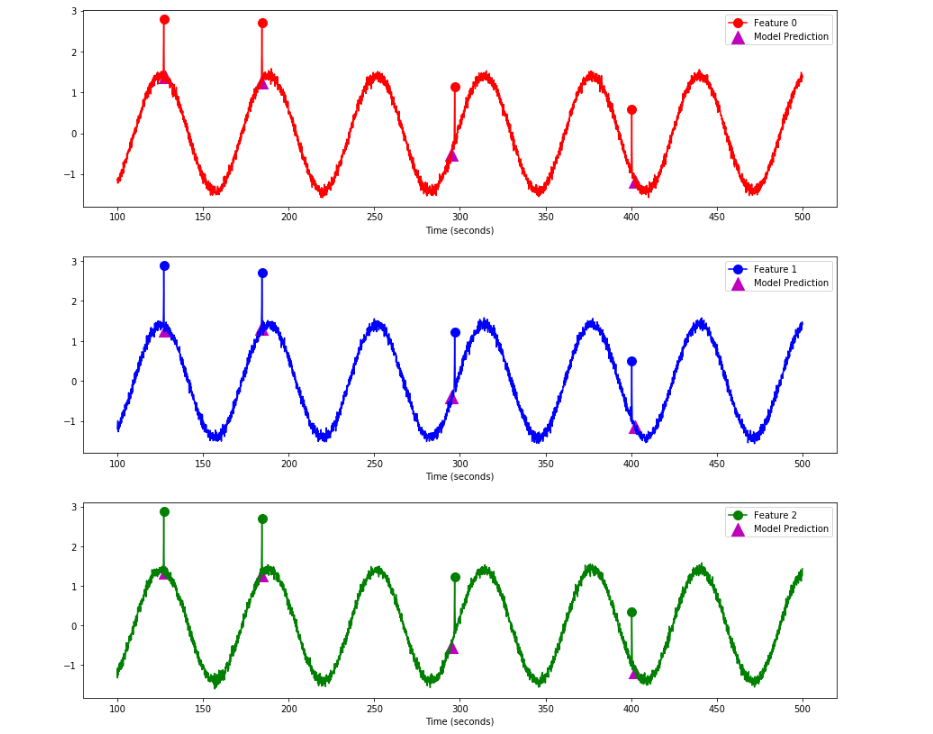
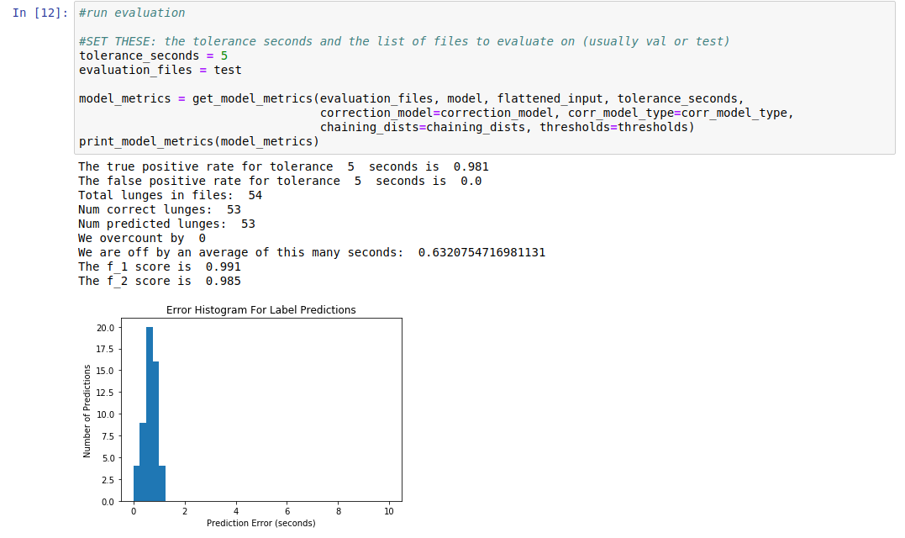
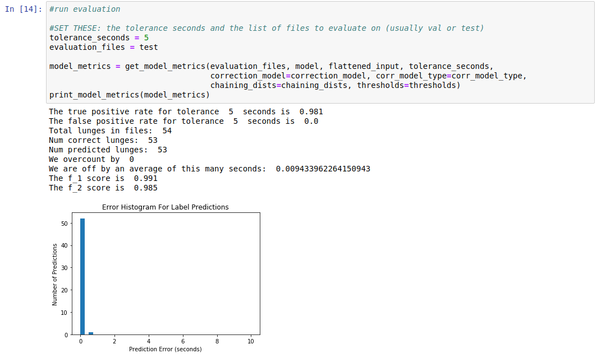

# Deep-Learning-Lunge-Detection

This repository contains an implementation for automatically labeling whale lunges from a time series of accelerometer data. The problem input is a finite time series of data. The problem output is a finite set of lunge times, indicated by defining features in the time series. 

To label the lunges, we use time series classification techniques with a sliding window approach. We train a labeling model that inputs a fixed length window (e.g. a 20 second window) of the time series. The network predicts whether there a lunge within some fixed time (e.g. 2 seconds) of the middle of the window. To obtain the lunge predictions, we slide the fixed-length window across the entire time series, obtain the model's predictions on these windows, and consolidate the predictions to produce the set of lunge times. Finally, we use a correction model to place the predictions closer to the true lunge times.

We have tried to make this tutorial and project usable for people (particularly in the biology research community) with minimal prior python experience. 

## Installation

First clone the project

```
git clone https://github.com/valdivia4/Deep-Learning-Lunge-Detection.git
cd Deep-Learning-Lunge-Detection
```

To install the Python dependencies, we recommend using a virtual environment along with either anaconda or pip.  Use the following commands to make and activate the virtual environment.

```
virtualenv venv
source venv/bin/activate
```

Then install the required packages from requirements.txt

```
pip3 install -r requirements.txt
```

## Example Usage

We include synthetic data with the project and recommend to run the code first with this synthetic data. The steps for using your own data will be mostly identical. Here we run through example usage using the synthetic data.

### Preprocessing
For training, the first step is to preprocess the data, which happens in the preprocessing directory. 

```
cd preprocessing
```

The raw lunge files for training, validation, and testing go in the raw_data directory. We assume a csv input where raw_data/inputs contains the time series of measurements and raw_data/labels contains the true labels of the lunges. For specifics on formatting, see the synthetic data provided in these folders.

When using your own data, you need to conform to the naming scheme in the files. For example inputs should be named in the following manner
```
inputs_0.txt
inputs_1.txt
...
```
and labels should be named in the following manner
```
labels_0.txt
labels_1.txt
...
```

The next step is to convert the data to numpy format

```
python3 convert_to_numpy.py
```

which performs some preprocessing on the data and saves it .npy format in the created numpy_data directory.

Next, modify the variables in the data_config.py file to conform to your provided data. 

These variables contain information about the train/val/test splits, information about the deployments such as the sampling frequency, and information about the desired padded_window and window sizes for training. Information about the variable meanings are commented in the file.

Then we create the windows used for training the labeling model.

```
python3 generate_train_windows
```

These windows are saved in the newly created Deep-Learning-Lunge-Detection/training_windows directory. 

We can also create the windows for the correction model. Do this step after training the labeling model and evaluating it (see next two sections), as the hyperparameters for the correction model depend on the labeling model's performance.
 
```
python3 generate_correction_model_windows
```

### Training

The next step is to train a labeling model. To do so, move to the Deep-Learning-Lunge-Detection/train directory.

There are two classes of models we currently support: a feed forward network and a 1D-ResNet. To design a models, edit the the appropriate variables in the model_configs file. (See the file comments for information on these variables.)

Next, set the config_name in the appropriate file. We will use the feed forward network here with the default feed_forward_config settings. So we would set config_name='feed_forward' in feed_forward_model.py. To train the model, we call

```
python3 feed_forward_model.py
```

And the model should begin training. After each epoch, the validation set metrics are printed and the current model (named by its validation set metrics) and the model config values are saved in the newly created Deep-Learning-Lunge-Detection/models/label_models/*experiment_date_and_time* directory.
 
 To train the ResNet, follow the same steps using the resnet_model.py file instead of feed_forward_model.py.
 
  It is best to train the correction model after evaluating the labeling model (see below). To train the correction model, call
 
 ```
 python3 correction_model_regression.py
 ```
 
 ### Evaluation
 
 Evaluation of model performance takes place in the Deep-Learning-Lunge-Detection/evaluate directory. This directory contains two Jupyter notebooks for evaluation. To start the Jupyter, call
 
 ```
 jupyter notebook
 ```
 
 in the evaluate directory.
 
 #### Plotting
 The first notebook plot_lunge_predictions plots a model's predictions on a deployment. To set which model to use, set the folder and model name, e.g.
 ```
 folder = 'feed_forward_Sat_Aug__3_11-51-22_2019'
 model_name = 'ep_2_tp_0.983_fp_0.0_f_1_0.991_f_2_0.986_chain_2_thresh_0.5'
 ```
 
 Then run the cells. You can select which range to plot the true labels and the model predictions by setting the startTime and endTime variables.
 
 Here is an example output on the synthetic data. The dots correspond to the true labels, and the triangles correspond to model predictions.
 
 
 
 #### Model Metrics
 
 The second notebook computes various model metrics on a set of deployments. Usually these metrics are computed on the test set of deployments. Below is an example output.
 
 
 
 * The true positive rate is the fraction of ground truth lunges that are within tolerance_seconds of a predicted lunge.
 * The false positive rate is the fraction of predicted lunges that are more than tolerance_seconds away from a ground truth lunge.
 * Number overcounted is the number of extra correct predictions. (E.g. if two model predictions are near the same true label.)
 
 The f_1 and f_2 scores are ways of combining the true positive rate and false positive rate into a single number.
 Finally the error histogram has the histogram of prediction errors in seconds. (Distance from the predicted label from the true label.)
 
 ###### Correction Model
 Use the error histogram above to tune the correction model window parameters in Deep-Learning-Lunge-Detection/preprocessing/dataconfig.py. 
 
 After generating the correction model windows and training the correction model, we can achieve much a much better error histogram. 
 
  
 
 ### Automatically Labeling New Deployments
 
 To use a model to label a new deployment, change to the Deep-Learning-Lunge-Detection/label_new_deployment directory. 
 
 Place the unlabeled deployments in the unlabeled_inputs directory. The required formatting is the same as in the preprocessing stage, and you can view the synthetic data provided in the unlabeled_inputs directory for specifics. However, the naming scheme can be different from the scheme (inputs_0, inputs_1, ...) that was required in preprocessing.
 
 Next, modify the indicated lines in label.py to pick which model to use and the correction model.  These are the same lines as in the evaluation stage, e.g.
 
  ```
 folder = 'feed_forward_Sat_Aug__3_11-51-22_2019'
 model_name = 'ep_2_tp_0.983_fp_0.0_f_1_0.991_f_2_0.986_chain_2_thresh_0.5'
 ```
 
 To generate the labels, call
 
 ```
 python3 label.py
 ```
 
 This call uses the model to automatically label all deployments in the unlabeled_inputs directory.
 
The generated labels are saved in the newly created predicted_labels directory. 
  
 ## Extras
 #### Future Work And Small Known Bugs

 Here are some minor issues we are aware of and need to fix:
 
 * It is possible to run out of memory on very long deployments.
 * If the number of overcounted lunges is not 0 in the model metrics (i.e. if two predictions are close to the same lunge), the values for the true positive rates and the false positive rates will be wrong. These numbers can be calculated by hand by subtracting the number of overcounted lunges from the number of correct lunges.
 
 For the future, we would like to use a softmax correction model with bins instead of a regression one. We would also like to include more models such as Fully Convolutional Networks.
 
 #### Contributors
 
 This project was completed by William McCloskey and Hugo Valdivia. We would like to thank the Goldbogen Lab at Hopkins Marine Station for providing the data and the problem.
 

